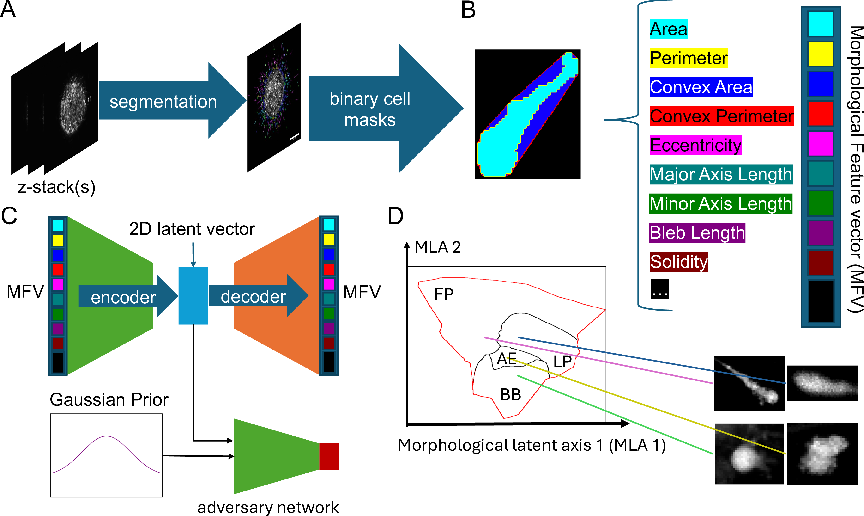
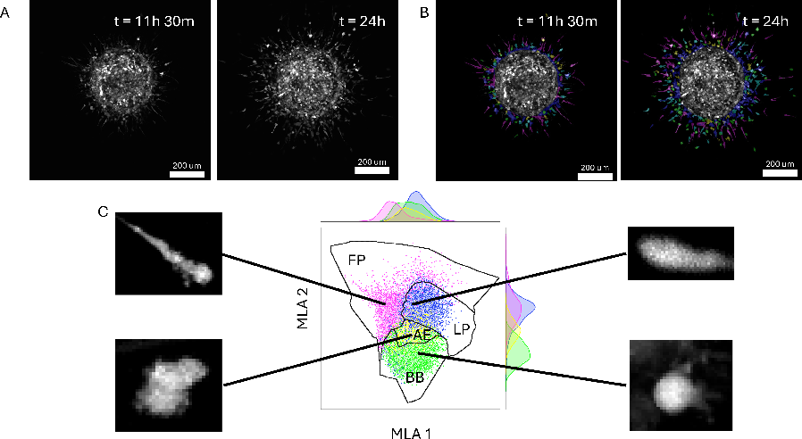
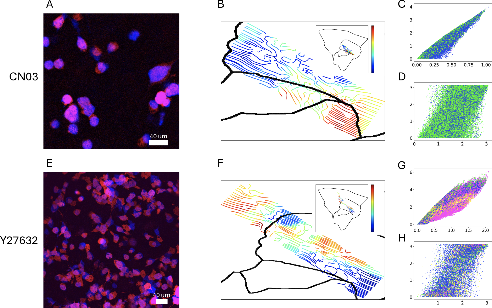
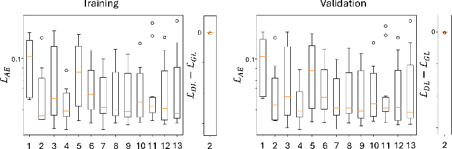

# Representation of High-Dimensional Cancer Cell Morphodynamics in 2-D Latent Space

[Paper - TBD](https://void)

## Overview

### Figure 1



### Examples

#### Spheroid



#### Drug Treatments



### Latent Dimensions



## Environment Setup

Using any conda-related python package manager, (substituting conda for micro-/miniconda).

### Tensorflow Environment

#### With CUDA Support

```sh
conda env create -f TensorFlowEnvironment.yml
```

#### Without CUDA Support

```sh
conda env create -f TensorFlowEnvironment-cpu.yml
```

### PyTorch Environment

#### With CUDA Support

```sh
conda env create -f PyTorchEnvironment.yml
```

#### Without CUDA Support

```sh
conda env create -f PyTorchEnvironment-cpu.yml
```

### Providing Source Code

```sh
export PYTHONPATH="${PYTHONPATH:+"${PYTHONPATH}:"}${PWD}/code/"
```

### Installing a Jupyter Kernel

```sh
python3 -m ipykernel install --user --name <NAME>
```

When starting a Jupyter server, make sure the PYTHONPATH has the `code/` directory.

## Usage

Example notebooks can be found in [notebooks/](notebooks/). Source code can be found in [code/](code/). Briefly, the [Tensorflow](https://www.tensorflow.org/) implementation is found in [code/sunlab/sunflow/](code/sunlab/sunflow) and the [PyTorch](https://pytorch.org/) implementation can be found in [code/sunlab/sunflow/](code/sunlab/suntorch). Environments used can be found in the source Yaml files ready to be used with [Anaconda](https://www.anaconda.com/) or related technology.

## Training

An example of training a standard autoencoder can be found in [notebooks/Autoencoder.ipynb](notebooks/Autoencoder.ipynb).

TODO: More implementations

## Pretrained Model Information

The MaxAbsScaler contains the scaling factors to transform the morphological features to the normalized features. The morphological features were derived from 1024x1024 pixel images on a confocal microscope (0.4NA, 10x objective) with a pixel to micron ratio of 1.075268.

## Obtaining Morphological data from Segmentations

In order to obtain the morphological vector components for each segmentation, we use the `CellTrack_DL.m` script, obtainable from [Chris Eddy's Github](https://github.com/eddy6081/CellTrack/) in the Matlab folder. We recommend the following folder structure for processing the segmentations to MFVs:
```
BaseDirectory
|-detections <- Set the mat_path to this directory's absolute path
| |-Frame_001.mat
| |-Frame_002.mat
| `-...
`-svm <- set the save_path to this directory's absolute path
  |-Image_001.tif (Output file)
  |-...
  `-svm.csv (Output file)
```
In each of the `*.mat` files, there should be two keys provided: `image` a (W,H,C) frame image and `labels` a (W,H) integer array of segmentations with the background set to `0`.

## SVM

In order to classify the morphological data to phenotypes, an additonal package must be installed: `onnxruntime` with `pip install onnxruntime` with the environment active.

### Usage

An example processing the data to the classification:
```python3
from sunlab.globals import FILES
from sunab.svm import *
dataset = dataframe[component_columns].to_numpy()
pixel2dist = 1.075268 # Change to pixel to micron ratio of the images the data was sourced from
svm_scaler, svm_clf = svm_load(FILES['SVM']['ONNX']['SCALER'], FILES['SVM']['ONNX']['MODEL'])
classification = svm_infer(dataset, pixel2dist=pixel2dist, scaler_model=svm_scaler, clf_model=svm_clf)
```