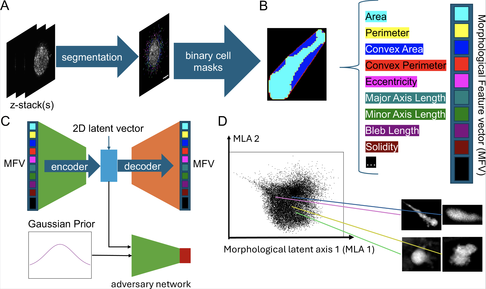
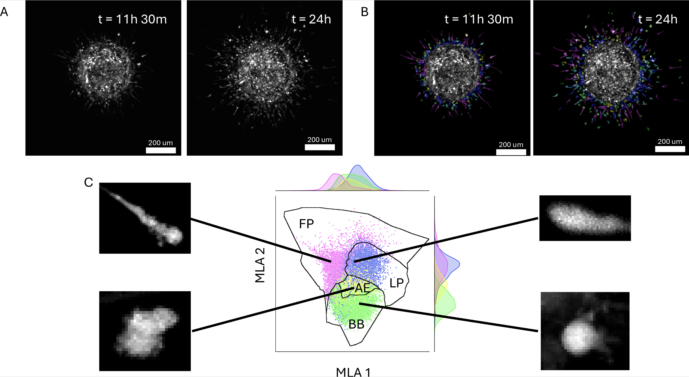

# Representation of High-Dimensional Cancer Cell Morphodynamics in 2-D Latent Space

[Paper - TBD](https://void)

TODO: Fill in figures

## Overview

### Figure 1

### Examples

#### Spheroid

#### Drug Treatments

### Latent Dimensions

## Usage

Example notebooks can be found in [notebooks/](notebooks/). Source code can be found in [code/](code/). Briefly, the [Tensorflow](https://www.tensorflow.org/) implementation is found in [code/sunlab/sunflow/](code/sunlab/sunflow) and the [PyTorch](https://pytorch.org/) implementation can be found in [code/sunlab/sunflow/](code/sunlab/suntorch). Environments used can be found in the source Yaml files ready to be used with [Anaconda](https://www.anaconda.com/) or related technology.

## Training

An example of training a standard autoencoder can be found in [notebooks/Autoencoder.ipynb](notebooks/Autoencoder.ipynb).

TODO: More implementations

## Pretrained Model Information

The MaxAbsScaler contains the scaling factors to transform the morphological features to the normalized features. The morphological features were derived from 1024x1024 pixel images on a confocal microscope (0.4NA, 10x objective) with a pixel to micron ratio of ??.
