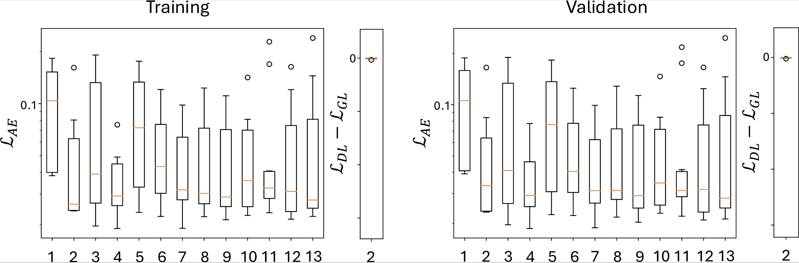

# Representation of High-Dimensional Cancer Cell Morphodynamics in 2-D Latent Space

[Paper - TBD](https://void)

## Overview

### Figure 1


### Examples

#### Spheroid


#### Drug Treatments


### Latent Dimensions



## Environment Setup

Using any conda-related python package manager, (substituting conda for micro-/miniconda).

### Tensorflow Environment

#### With CUDA Support

```sh
conda env create -f TensorFlowEnvironment.yml
```

#### Without CUDA Support

```sh
conda env create -f TensorFlowEnvironment-cpu.yml
```

### PyTorch Environment

#### With CUDA Support

```sh
conda env create -f PyTorchEnvironment.yml
```

#### Without CUDA Support

```sh
conda env create -f PyTorchEnvironment-cpu.yml
```

### Providing Source Code

```sh
export PYTHONPATH="${PYTHONPATH:+"${PYTHONPATH}:"}${PWD}/code/"
```

### Installing a Jupyter Kernel

```sh
python3 -m ipykernel install --user --name <NAME>
```

When starting a Jupyter server, make sure the PYTHONPATH has the `code/` directory.

## Usage

Example notebooks can be found in [notebooks/](notebooks/). Source code can be found in [code/](code/). Briefly, the [Tensorflow](https://www.tensorflow.org/) implementation is found in [code/sunlab/sunflow/](code/sunlab/sunflow) and the [PyTorch](https://pytorch.org/) implementation can be found in [code/sunlab/sunflow/](code/sunlab/suntorch). Environments used can be found in the source Yaml files ready to be used with [Anaconda](https://www.anaconda.com/) or related technology.

## Notebooks

### Training

Two examples of training models can be found in:
 - [Autoencoder](notebooks/Training-Autoencoder.ipynb)
 - [Adversarial Autoencoder](notebooks/Training-AdversarialAutoencoder.ipynb)

### Pretrained

One example using a pretrained model on sample data can be found in:
 - [Adversarial Autoencoder](notebooks/Inference-AdversarialAutoencoder.ipynb)

### Applying to a LIVECell Dataset

One example of the segmentation to latent space pipeline can be found in:
 - [LIVECell - MCF7](notebooks/LIVECell-Example-MCF7.ipynb)
This notebook demonstrates the processing of segmentation frames to matlab files, processing the segmentations to morphologies, then projecting to a latent space.
MATLAB is required to turn the segmentations to Morphology Features.

By changing the CELL variable, as described in the header cell of the notebook, other cell lines can be segmented.

### Other Analysis Notebooks

Other, more messy, analysis notebooks can be found on the `analysis` branch: `git switch analysis`.
These notebooks encompass the remaining analyses found in the paper.
The spheroid images that were segmented and processed can be found at the [Figshare Collection](https://doi.org/10.6084/m9.figshare.c.7539075).

### Older Notebooks

Older notebooks are also found in `old_notebooks`, which include:
 - Notebook used to transfer the model from Tensorflow to PyTorch
 - Example loading the pretrained model in PyTorch
 - Notebook generating the plots for the performance of different latent sizes

## Pretrained Model Information

The MaxAbsScaler contains the scaling factors to transform the morphological features to the normalized features. The morphological features were derived from 1024x1024 pixel images on a confocal microscope (0.4NA, 10x objective) with a pixel to micron ratio of 1.075268.

## Obtaining Morphological data from Segmentations

In order to obtain the morphological vector components for each segmentation, we use the `CellTrack_DL.m` script, obtainable from [Chris Eddy's Github](https://github.com/eddy6081/CellTrack/) in the Matlab folder. We recommend the following folder structure for processing the segmentations to MFVs:
```
BaseDirectory
|-detections <- Set the mat_path to this directory's absolute path
| |-Frame_001.mat
| |-Frame_002.mat
| `-...
`-svm <- set the save_path to this directory's absolute path
  |-Image_001.tif (Output file)
  |-...
  `-svm.csv (Output file)
```
In each of the `*.mat` files, there should be two keys provided: `image` a (W,H,C) frame image and `labels` a (W,H) integer array of segmentations with the background set to `0`.

### CellTrack_DL.m Modifications
In order to automatically process files in MATLAB batch mode more efficiently, a slightly modified version of `CellTrack_DL.m` was used and is provided in `extra_data/CellTrack_DL.m`.

With this modification, the files can be processed in batch mode, substituting the `{MAT_PATH}` and `{SAVE_PATH}` absolute paths, with: `matlab -batch "save_path='{SAVE_PATH}';mat_path='{MAT_PATH}';run('Matlab/CellTrack_DL.m');exit;"`

## SVM

In order to classify the morphological data to phenotypes, an additonal package must be installed: `onnxruntime` with `pip install onnxruntime` with the environment active.

### Usage

An example processing the data to the classification:
```python3
from sunlab.globals import FILES
from sunab.svm import *
dataset = dataframe[component_columns].to_numpy()
pixel2dist = 1.075268 # Change to pixel to micron ratio of the images the data was sourced from
svm_scaler, svm_clf = svm_load(FILES['SVM']['ONNX']['SCALER'], FILES['SVM']['ONNX']['MODEL'])
classification = svm_infer(dataset, pixel2dist=pixel2dist, scaler_model=svm_scaler, clf_model=svm_clf)
```